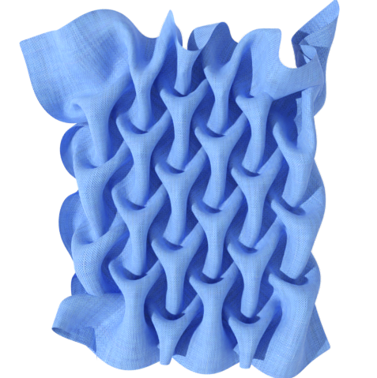
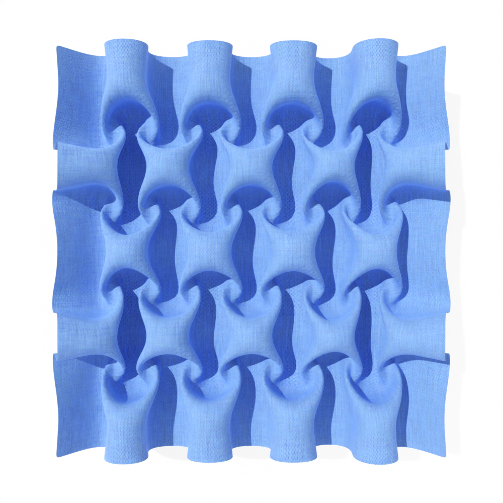
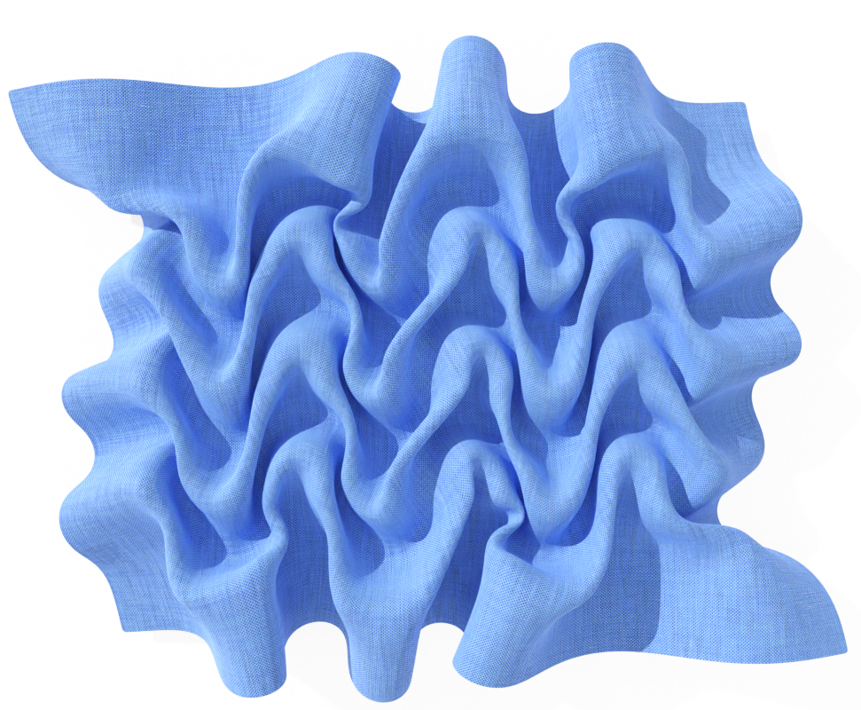
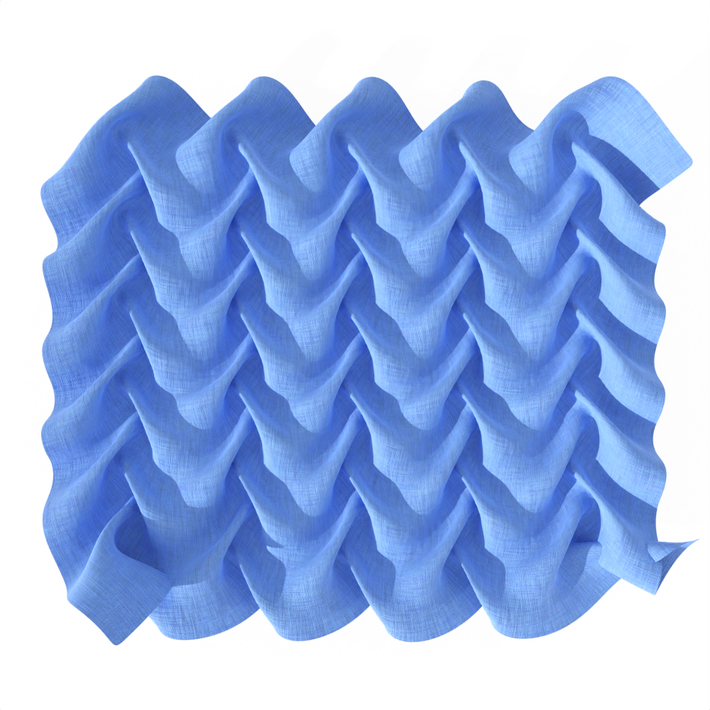
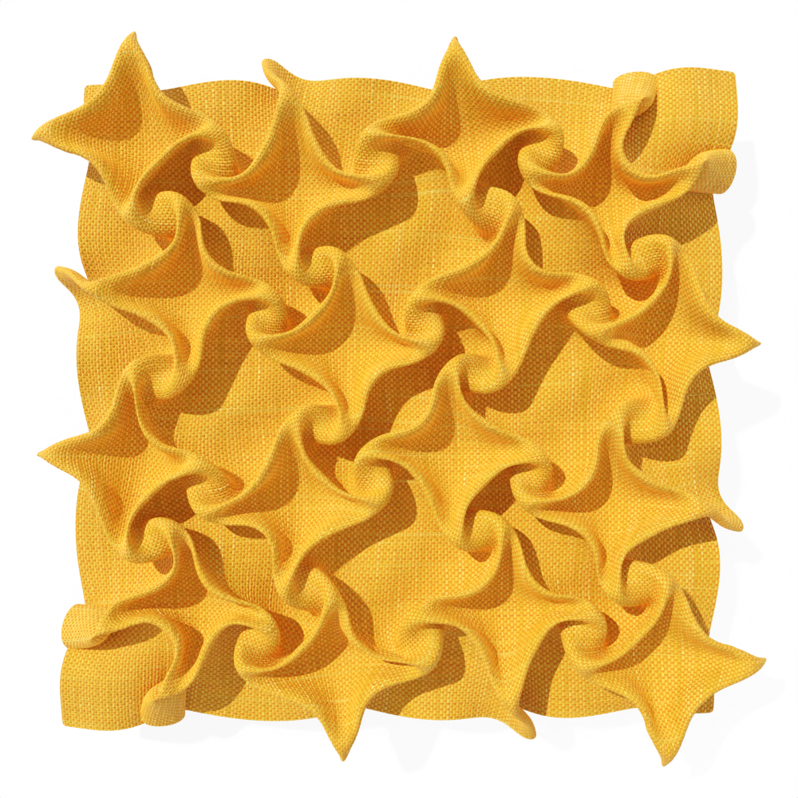
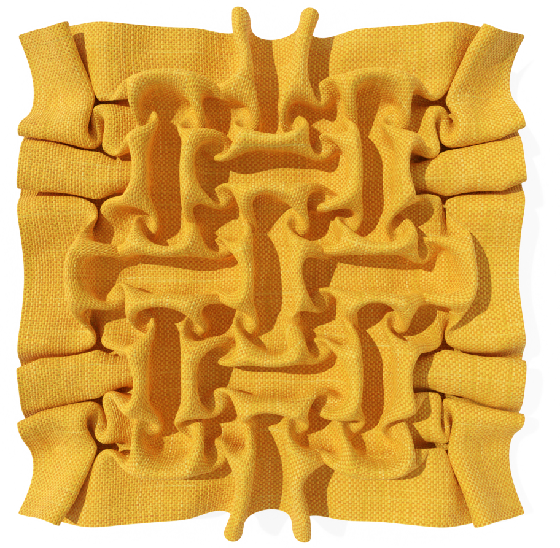
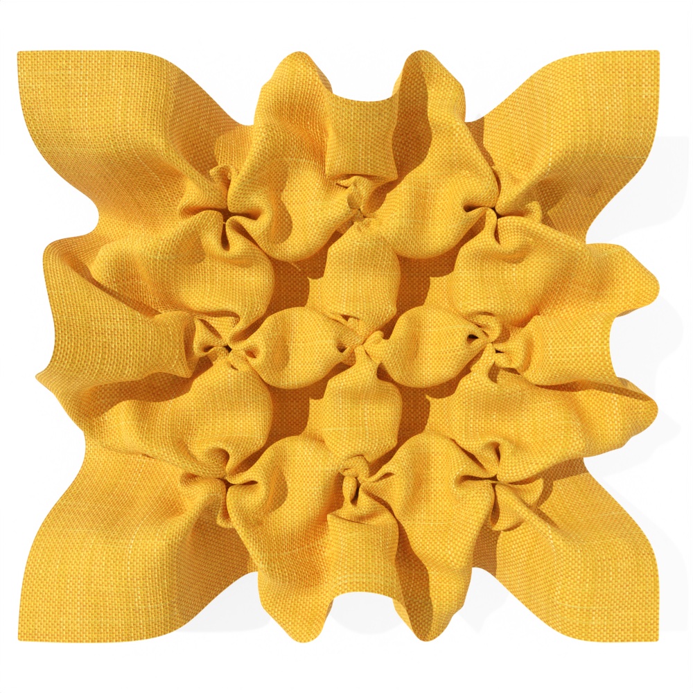

# Digital 3D Smocking Design
This is an example code for our paper "Digital 3D Smocking Design", by [Jing Ren](https://ren-jing.com/), [Aviv Segall](https://igl.ethz.ch/people/), and [Olga Sorkine-Hornung](https://igl.ethz.ch/people/sorkine).

In this project, we develop an optimization-based method to model smocking, a surface embroidery technique that provides decorative geometric texturing while maintaining stretch properties of the fabric. We formulate smocking as a **graph embedding** and **shape deformation** problem. We extract a coarse graph representing the fabric and the stitching constraints, and then derive the graph structure of the smocked result. We solve for the 3D embedding of this graph, which in turn reliably guides the deformation of the high-resolution fabric mesh.

You can find more details at: [[paper]]() | [[suppl. video]]() |  [[suppl. material]]() | [[slides]]() 

## What is smocking?
**Smocking** is a *surface embroidery* technique that provides decorative geometric texturing while maintaining stretch properties of the fabric. During smocking, multiple pairs of points on the fabric are stitched together, creating non-manifold geometric features and visually pleasing textures. Designing smocking patterns is challenging, because the outcome of stitching is unpredictable: the final texture is often revealed only when the whole smocking process is completed, necessitating painstaking physical fabrication and time consuming trial-and-error experimentation. 

Below we show an example of fabricating the arrow smocking pattern: we first draw the smocking pattern in the fabric (*left*); then we stitch each polyline individually, where are the grid nodes in the polyline are gathered and stitched together (*middle*). We also show its front view on the *right*, where we can see that the stitches are not visible and the resulting textures are volumetric.
| draw stitching pattern | stitching (back view) | stitching (front view)|
| :---: | :---: | :---: |
|  |    |     |

If you are interested, you might find the following **references** helpful:
- Exibition: [A smocked child's garment (1900-1905)](https://www.metmuseum.org/art/collection/search/157326), from *Liverty & Co*
- Exibition: [Smocked garments in 19th Century](https://www.reading.ac.uk/merl/the_collections/the_museum/smocks.html) exibited in *The Musuem of English Rural life*
- Book: ["Stitching for Style: Fabric Manipulation for Self-Trim"](https://www.amazon.com/Stitching-style-Fabric-manipulation-self/dp/B0007E68JQ/ref=sr_1_3?qid=1671114643&refinements=p_27%3ANelle+Weymouth+Link&s=books&sr=1-3&text=Nelle+Weymouth+Link), by *Nelle Weymouth Link*, 1948
- Book: ["Smocking: Techniques, Projects and Designs"](https://www.amazon.com/Smocking-Technique-Projects-Designs-Needlework/dp/0486237885/ref=sr_1_1?crid=1TPKQEUQOJBYN&keywords=Smocking%3A+Techniques%2C+Projects+and+Designs&qid=1671115788&s=books&sprefix=smocking+techniques%2C+projects+and+designs%2Cstripbooks-intl-ship%2C138&sr=1-1), by *Dianne Durand*, 1979
- Book: ["The Hidden History of the Smock Frock"](https://www.amazon.com/Hidden-History-Smock-Frock-Interconnections-ebook/dp/B08XB61HM6/ref=sr_1_1?crid=1DMV4JVOB5CAI&keywords=The+Hidden+History+of+the+Smock+Frock&qid=1671115836&s=books&sprefix=the+hidden+history+of+the+smock+frock%2Cstripbooks-intl-ship%2C149&sr=1-1), by *Alison Toplis*, 2021
- Book: ["Make, Sew and Mend: Traditional Techniques to Sustainably Maintain and Refashion Your Clothes"](https://www.amazon.com/Make-Sew-Mend-Traditional-Sustainably-ebook/dp/B0927CXBZ7/ref=d_pd_sbs_sccl_1_4/140-8254660-3543427?pd_rd_w=z2qXc&content-id=amzn1.sym.3676f086-9496-4fd7-8490-77cf7f43f846&pf_rd_p=3676f086-9496-4fd7-8490-77cf7f43f846&pf_rd_r=W07K2BNSVXZF3EYYSP3J&pd_rd_wg=ltHTt&pd_rd_r=56f1a4c9-e627-4502-a493-a9f3e6a1090b&pd_rd_i=B0927CXBZ7&psc=1&asin=B0927CXBZ7&revisionId=d484b606&format=1&depth=1) by *Bernadette Banner*, 2022
- Magazines: ["Origami Tessellation Style Modern Smocking Pattern vol.1-6"](https://www.amazon.com/Origami-tessellation-modern-smocking-pattern/dp/B09PK4DHQR/ref=sr_1_2?crid=23GWCMNYDI3Y0&keywords=modern+smocking+pattern&qid=1671115873&s=books&sprefix=modern+smocking+pattern%2Cstripbooks-intl-ship%2C142&sr=1-2), by *MsKapolo Design*, 2021
- Tutorial: [Canadian Smocking Tutorial (Heart Shaped Pattern)](https://www.youtube.com/watch?v=WCcrPTtcH-s) by YouTuber *OV'S COUTURE*.

## Our results v.s. Fabrications
| name  | arrow |  box  | triangle | leaf | basket |
| :---: | :---: | :---: | :---: | :---:| :---:  |
| our results | | | |  |  | 
| real fabrications  |  [YouTube link](https://www.youtube.com/watch?v=W7dUpMPPVfQ)  | see our paper  | [YouTube link](https://www.youtube.com/watch?v=arIAkrwxxmI) | [YouTube link](https://www.youtube.com/watch?v=xhgMBxavd0s)  | [YouTube link](https://www.youtube.com/watch?v=6jOuF65d3zw) |

| name  |zigzag | braid | diamond | brick | flower |
| :---: | :---: | :---: | :---: | :---:| :---:  |
| our results | |  |  |  |  |
| real fabrications  | [YouTube link](https://www.youtube.com/watch?v=hQ0XvybPnYI)  | [YouTube link](https://www.youtube.com/watch?v=Ju8Q48D10V4) | see our paper | [Pinterest](https://www.pinterest.ch/pin/56506170339464885/) | [YouTube link](https://www.youtube.com/watch?v=cVM75PL3RLQ) |

### Implementation
- [Blender Add-on](https://github.com/llorz/SmockingDesign/blob/main/python_implementation/utils/SmockingDesignAddOn.py): we provide a blender add-on, which can be used for designing/modifying smocking patterns and previewing the corresponding smocked design
- [Matlab prototype](https://github.com/llorz/SmockingDesign/tree/main/matlab_implementation): we also provide a matlab implementation for smocking design preview.

### Baseline methods
1. **C-IPC: Codimensional Incremental Potential Contact**, Minchen Li, Danny M. Kaufman, Chenfanfu Jiang, *ACM Transactions on Graphics (SIGGRAPH 2021)* [ [code] ](https://github.com/ipc-sim/Codim-IPC)
2. **ARCSim: Adaptive Refining and Coarsening Simulator**, Rahul Narain, Armin Samii, and James F O’brien, *ACM Transactions on Graphics (SIGGRAPH 2012)*  [[original code]](http://graphics.berkeley.edu/resources/ARCSim/) [[code we used]](https://git.ista.ac.at/gsperl/ARCSim-HYLC)
3. **Commercial softwares**: [Blender](https://www.blender.org/) and [Marvelous Designer](https://marvelousdesigner.com/)

## Comments
### Acknowledgements
The authors thank the anonymous reviewers for their valuable comments. 
We would like to thank ***Minchen Li*** for helping with the comparison to C-IPC. We also thank ***Georg Sperl*** and ***Rahul Narain*** for helping with the comparison to ARCSim.

### Contact
Please let us know (jing.ren, aviv.segall, @inf.ethz.ch) if you have any question regarding the algorithms/paper or you find any bugs in the code ε-(´∀｀; )
This work is licensed under a [Creative Commons Attribution-NonCommercial 4.0 International License](http://creativecommons.org/licenses/by-nc/4.0/). For any commercial uses or derivatives, please contact us (jing.ren, aviv.segall, sorkine, @inf.ethz.ch). 

