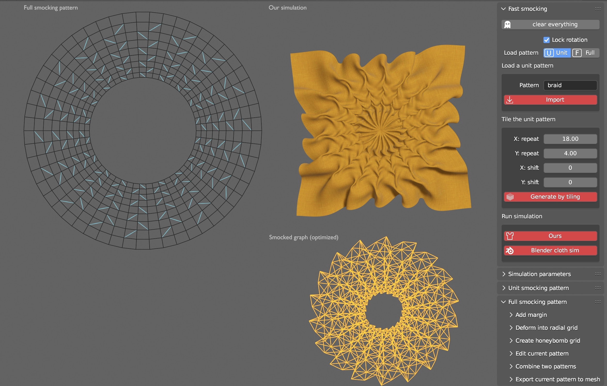

# Interactive User Interface for Smocking Design \& Preview

  

We implement an interactive user interface in Blender as an add-on including the following functionalities:

- ***define a unit smocking pattern*** by creating a 2D grid and drawing stitching lines-
-  ***define a full smocking pattern*** by:
   - tiling the loaded unit smocking pattern (with user-defined repetition and shift of the unit pattern)
   - drawing stitching lines directly on a square or hexagonal grid to define the full pattern
- ***modify a full smocking pattern*** by
   - deforming the square grid into a radial grid (with user-defined radius)
   - adding margins to the pattern
   - combining it with another smocking pattern (along user-specified axis and space)
   - deleting/adding stitching lines from/to the pattern
- ***simulate the smocked pattern*** with intermediate steps including
   - extracting the smocked graph from the pattern
   - embedding the underlay and pleat subgraphs of the smocked graph
   - applying ARAP to compute the smocking design
- ***render the smocking design***
- ***run cloth simulator*** implemented in Blender on the fine-resolution smocking pattern
  
## Usage 
0. install scipy in Blender's python:
 /path/to/blender/4.0/python/bin/python3.10 -m pip install scipy
1. install the [add-on](https://github.com/llorz/SmockingDesign/blob/main/python_implementation/smocking_design.zip) in Blender ([reference](https://docs.blender.org/manual/en/latest/editors/preferences/addons.html))
2. follow our [supplematory video](https://youtu.be/vjnmbmO3zcg) to see some examples of using this UI

## Compilation of the c++ code
In case the compiled versions do not match your OS, you can compile the c++ code by:

1. cd python_implementation/native
2. mkdir build; cd build
3. cmake -DCMAKE_BUILD_TYPE=Release ../
4. make -j

After a successful compilation, you'll find a file named 'cpp_smocking_solver.{some_os_dependent_suffix}' in the build/ directory.

Copy the file to python_implementation/smocking_design, compress this directory to a zip file and install it in Blender.